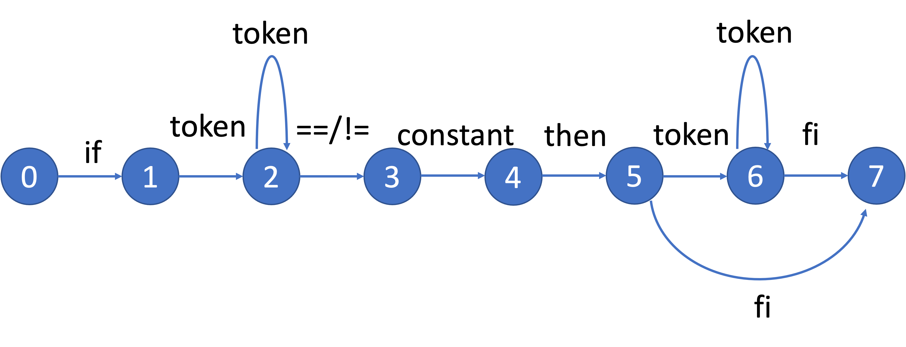
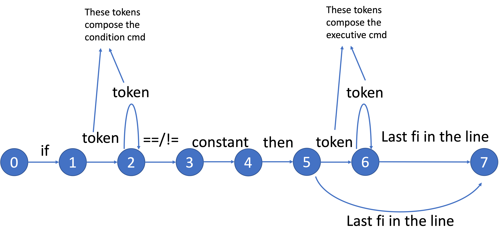

# COMP SCI 537 Discussion Week 5

## File Descriptor: How It Works

If you have event printed out a file descriptor, you may notice it is just an integer

```C
int fd = open("filename", O_RDONLY);
printf("fd: %d\n", fd);
// you may get output "3\n"
```

However, the file-related operation is stateful: e.g. it must keep a record what is the current read/write offset, etc. How does an integer encoding this information?

It turns out there is a level of indirection here: the kernel maintains such states and the file descriptor it returns is essentially a "handler" for later index back to these states. The kernel provides the guarantee that "the user provides the file descriptor and the operations to perform, the kernel will look up the file states that corresponding to the file descriptor and operate on it".

It would be helpful to understand what happens with some actual code from a kernel. For simplicity, we use ths xv6 code below to illustrate how file descriptor works, but remember, your p3 is on Linux. Linux has a very similar implementation.

For every process state (`struct proc` in xv6), it has an array of `struct file` (see the field  `proc.ofile`) to keep a record of the files this process has opened.

```C
// In proc.h
struct proc {
  // ...
  int pid;
  // ...
  struct file *ofile[NOFILE];  // Open files
};

// In file.h
struct file {
  // ...
  char readable;    // these two variables are actually boolean, but C doesn't have `bool` type,
  char writable;    // so the authors use `char`
  // ...
  struct inode *ip; // this is a pointer to another data structure called `inode`
  uint off;         // offset
};
```

The file descriptor is essentially an index for `proc.ofile`. In the example above, when opening a file named "filename", the kernel allocates a `struct file` for all the related state of this file. Then it stores the address of this `struct file` into `proc.ofile[3]`. In the future, when providing the file descript `3`, the kernel could get `struct file` by using `3` to index `proc.ofile`. This also gives you a reason why you should `close()` a file after done with it: the kernel will not free `struct file` until you `close()` it; also `proc.ofile` is a fixed-size array, so it has limit on how many files a process can open at max (`NOFILE`).

In addition, file descriptors `0`, `1`, `2` are reserved for stdin, stdout, and stderr.

### File Descriptors after `fork()`

During `fork()`, the new child process will copy `proc.ofile` (i.e. copying the pointers to `struct file`), but not `struct file` themselves. In other words, after `fork()`, both parent and child will share `struct file`. If the parent changes the offset, the change will also be visible to the child.

```
struct proc: parent {
    +---+
    | 0 | ------------+---------> [struct file: stdin]
    +---+             |
    | 1 | --------------+-------> [struct file: stdout]
    +---+             | |
    | 2 | ----------------+-----> [struct file: stderr]
    +---+             | | |
    ...               | | |
}                     | | |
                      | | |
struct proc: child {  | | |
    +---+             | | |
    | 0 | ------------+ | |
    +---+               | |
    | 1 | --------------+ |
    +---+                 |
    | 2 | ----------------+
    +---+
    ...
}
```

## Redirection

### High-level Ideas of Redirection: What to Do

When a process writes to stdout, what it actually does it is writing data to the file that is associated with the file descriptor `1`. So the trick of redirection is, we could replace the `struct file` pointer at `proc.ofile[1]` with another `struct file`.

For example, when handling the shell command `ls > log.txt`, what the file descriptors eventually should look like:

```
struct proc: parent {                                      <= `mysh` process
    +---+
    | 0 | ------------+---------> [struct file: stdin]
    +---+             |
    | 1 | ----------------------> [struct file: stdout]
    +---+             | 
    | 2 | ----------------+-----> [struct file: stderr]
    +---+             |   |
    ...               |   |
}                     |   |
                      |   |
struct proc: child {  |   |                                <= `ls` process
    +---+             |   |
    | 0 | ------------+   |
    +---+                 |
    | 1 | ----------------|-----> [struct file: log.txt]   <= this is a new stdout!
    +---+                 |
    | 2 | ----------------+
    +---+
    ...
}
```

### `dup2()`: How to Do

The trick to implement the redirection is the syscall `dup2`. This syscall performs the task of "duplicating a file descriptor".

```C
int dup2(int oldfd, int newfd);
```

`dup2` takes two file descriptors as the arguments. It performs these tasks (with some pseudo-code):

1. if the file descriptor `newfd` has some associated files, close it. (`close(newfd)`)
2. copy the file associated with `oldfd` to `newfd`. (`proc.ofile[newfd] = proc.ofile[oldfd]`)

Consider the provious example with `dup2`:

```C
int pid = fork();
if (pid == 0) { // child;
    int fd = open("log.txt", O_WRONLY | O_CREAT | O_TRUNC, 0644); // [1]
    dup2(fd, fileno(stdout));                                     // [2]
    // execv(...)
}
```

Here `fileno(stdout)` will give the file descriptor associated with the current stdout. After executing `[1]`, you should have:

```
struct proc: parent {                                     <= `mysh` process
    +---+
    | 0 | ------------+---------> [struct file: stdin]
    +---+             |
    | 1 | --------------+-------> [struct file: stdout]
    +---+             | |
    | 2 | ----------------+-----> [struct file: stderr]
    +---+             | | |
    ...               | | |
}                     | | |
                      | | |
struct proc: child {  | | |                               <= child process (before execv "ls")
    +---+             | | |
    | 0 | ------------+ | |
    +---+               | |
    | 1 | --------------+ |
    +---+                 |
    | 2 | ----------------+
    +---+
    | 3 | ----------------------> [struct file: log.txt]  <= open a file "log.txt"
    +---+
    ...
}
```

After executing `[2]`, you should have

```
struct proc: parent {                                     <= `mysh` process
    +---+
    | 0 | ------------+---------> [struct file: stdin]
    +---+             |
    | 1 | ----------------------> [struct file: stdout]
    +---+             | 
    | 2 | ----------------+-----> [struct file: stderr]
    +---+             |   |
    ...               |   |
}                     |   |
                      |   |
struct proc: child {  |   |                               <= child process (before execv "ls")
    +---+             |   |
    | 0 | ------------+   |
    +---+                 |
    | 1 | --------------+ |
    +---+               | |
    | 2 | ----------------+
    +---+               |
    | 3 | --------------+-------> [struct file: log.txt]
    +---+
    ...
}
```

Alas, compared to the figure of what we want, it has a redudent file descriptor `3`. We should close it. The modified code should look like this:

```C
int pid = fork();
if (pid == 0) { // child;
    int fd = open("log.txt", O_WRONLY | O_CREAT | O_TRUNC, 0644); // [1]
    dup2(fd, fileno(stdout));                                     // [2]
    close(fd);                                                    // [3]
    // execv(...)
}
```

After we finishing `dup2`, the previous `fd` is no longer useful. We close it at `[3]`. Then the file descriptors should look like this:

```
struct proc: parent {                                     <= `mysh` process
    +---+
    | 0 | ------------+---------> [struct file: stdin]
    +---+             |
    | 1 | ----------------------> [struct file: stdout]
    +---+             | 
    | 2 | ----------------+-----> [struct file: stderr]
    +---+             |   |
    ...               |   |
}                     |   |
                      |   |
struct proc: child {  |   |                               <= child process (before execv "ls")
    +---+             |   |
    | 0 | ------------+   |
    +---+                 |
    | 1 | --------------+ |
    +---+               | |
    | 2 | ----------------+
    +---+               |
    | X |               +-------> [struct file: log.txt]
    +---+
    ...
}
```

Despite the terrible drawing, we now have what we want! You can imagine doing it in a similar way for stdin redirection.

Again, you should read the [document](https://man7.org/linux/man-pages/man2/dup2.2.html) yourself to understand how to use it.

Fun fact, piping is actually also implemented in a similar way.

## Difference Between `FILE*` and File Descriptors

Other than `open`, you may also see functions like `fopen`:

```C
FILE *fopen(const char *pathname, const char *mode);
```

The return value of `fopen` is a `FILE` pointer, not an integer (file descriptor).

Note that, `fopen()` is not a syscall, but a library function (in `stdio.h`. It is a wrapper built on top of `open()`. Similarly, `FILE` is also defined in `stdio.h`, which implements some buffering for IO. When calling `fopen()`, the library allocates a `FILE` object for you on the heap. When calling `fclose()`, it then frees `FILE` for you. Note that you should never free `FILE` yourself. Whatever allocated by the library, unless otherwise specified, you should leave it to the library to free them.

## If Statement

For the if statement, we need to parse the line to several parts: the condition command, comparison operator, constant, and executive command. For example:

```bash
if      one          ==        1        then       hello       fi
  (condition cmd)    (op)  (CONSTANT)         (EXECUTIIVE CMD)
```

We can use the following state machine to help us achieve it (the tokens between if and operator becomes condition cmd; the tokens between then and fi becomes executive cmd):




Now, consider a nested if statement:

```bash
if one == 1 then if one != 0 then hello fi fi
```


We can still parse it into the condition command, comparison operator, constant, and executive command.

```bash
if      one          ==        1        then     if one != 0 then hello fi     fi
  (condition cmd)    (op)  (CONSTANT)                 (EXECUTIIVE CMD)
```


To parse nested if statement, we need to modify the state machine a little bit to (we only want to recognize the last "fi" in the line as the end of if statement):



In this case, any token between "then" and the last "fi" in the line becomes executive cmd. Then, we treat the executive cmd `if one != 0 then hello fi` as a new line and go through the state machine again.

## Memory management problems

**Q1: Given the following program that uses three memory segments in an address space as described in class (code segment, heap segment ,and stack segment):**

```c
char a[100];
main(int argc, char ** argv)
{
    int d;
    static double b;
    char *s = "boo", * p;

    p = malloc(300);
    return 0;
}
```

Identify the segment in which each variable resides and indicate if the variable is private to the thread or is shared among threads.


Solution:

*The array a, the static variable b, and the string constant "boo" are all in the data segment and are shared across threads.
The arguments argc and argv are in the stack segment and are private to the thread.
The automatic variables d, s, and p are also in the stack segment and are private to the thread.
Note that the variable p itself is in the stack segment (private), but the object it points to is in the data segment which is a shared region of an address space(that's why the be careful warning). The contents of s consist of the address of the string "boo" which happens to be in the data segment (shared).*


**Q2: Do you need any hardware features to support static and dynamic relocation? If so, how these hardware features might be used for virtual to physical address translations. If not, explain why not?**

**No** for static - the addresses are calculated at load time.
**Yes** for dynamic. For dynamic relocation you need hardware support for **base** and **limit/relocation** registers.


**Q3: Does static relocation / pure segmentation / pure paging suffers from external fragmentation?** 

Static relocation suffers from external fragmentation: holes develop as old processes dies and new processes initiate.

Pure segmentation suffers from external fragmentation: fragmentation would occur when segments of dead processes are replaced by segments of new processes.

Pure paging: will not.


**Q4: To share code across processes efficiently, which policy is better? static relocation / pure segmentation / pure paging?**

Pure segmentation is the best. Two different processes can share the same code segment but have distinct data and stack segments.

Pure paging can also share the code, but in page granuality. 

Static relocation doesn't support code sharing since we cannot break the address space of a process into fine-grained segments.
