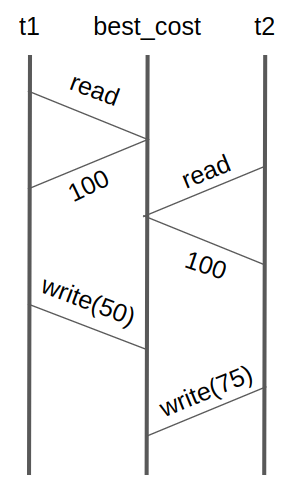
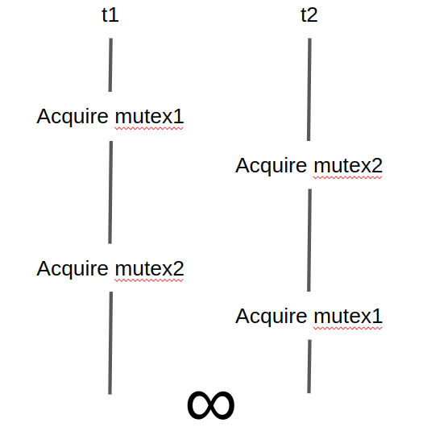

# Discussion Materials Week 7

We are going to introduce the pthread, short for POSIX thread, library

### Quick refresher:

A thread is an independent execution sequence within a single process.

When we used `fork()` to spawn a process, it got it’s own, separate address space. What memory can a thread access?

When a process spawns a thread, it actually subdivides the stack into miniature stacks, one for each thread. 


The threads are then allocated time slices and are switched to/from, similar to how the OS scheduler switches between processes.

****************************************************************************************************************************What are some pros/cons of threads in comparison to processes?****************************************************************************************************************************

Pros:

- Easier communication between threads due to same virtual address space
- Lightweight in comparison
- Context switching between threads is less expensive, no need for an interrupt

Cons:

- No security between threads, same address space, thus **race conditions**
- One thread can read, manipulate, or delete another thread’s data
- If one thread blocks, all threads block

There are various thread operations that we will need to perform in order to do the next project (hint: it will have to do with thread concurrency. Let’s look at a short program that utilizes the pthread library.

```c
#include <stdio.h>
#include <stdlib.h>
#include <unistd.h>
#include <pthread.h>
  
// A normal C function that is executed as a thread 
// when its name is specified in pthread_create()
void *helloWorld(void *vargp)
{
    sleep(1);
    printf("Hello World \n");
    pthread_exit(NULL);
}
   
int main()
{
    pthread_t thread_id;
    printf("Before Thread\n");
    pthread_create(&thread_id, NULL, helloWorld, NULL);
    pthread_join(thread_id, NULL);
    printf("After Thread\n");
    exit(0);
}
```

What happens is we create a thread in `main()`, which runs the `helloWorld()` function, and then we join back to `main()`. The output would be:

```bash
Before Thread
Hello World
After Thread
```

As you can see in `main()`, there are a few pthread library functions and data types we are using:

- `pthread_t`: The most basic data type in the pthread library, acts as a “handle” for a thread, i.e. how the parent may manage the thread
- `pthread_create()`: Used to actually spawn a thread and make it runable. The arguments are:
    - `pthread_t* thread`: A pointer to a `pthread_t`
    - `const pthread_attr_t *attr`: An object that can be used to set thread attributes. Can be set to NULL for default values
    - `void* (*start)(void *)`: The name of the function that the thread will execute once created
    - `void *arg`: A single argument that can be passed to the start routine, can be set to NULL if no arguments are needed
- `pthread_join()`: Similar to how `wait()` allows the parent process to wait for a child process to finish execution, this method essentially does the same thing for threads. It takes two arguments:
    - `pthread_t thread`: The `pthread_t` object that corresponds to the thread we wish to wait on
    - `void **retval`: A pointer where `pthread_join()` can copy the exit status of a completed thread, similar how you could pass a pointer into `waitpid()`
- `pthread_exit()`: Exits a thread, similar to how `exit()` works for a process. It takes one parameter:
    - `void *retval`: A pointer that stores the return value, which can be grabbed by the parent thread through the second parameter in `pthread_join()`

These operations should be all you need to handle thread creation and synchronization.

## Race conditions

Loosely defined as any situation in which the desired output of a sequence of events requires the events to be performed in a specific order, but the events don’t always happen in that order. Thus, there is a ‘race’ between the events This can happen while performing multithreading if threads access a shared piece of memory. 

Consider this example thread function (start routine) that refers to a global variable `best_cost`

```c
if(my_cost < best_cost)
	best_cost = my_cost
```

Let’s assume the initial value of `best_cost` is set to 100, and the values of `my_cost` are 50 and 75 for threads `t1` and `t2`. `best_cost` could wind up being 50 or 75 after execution of the two threads. 

The following situation could very well be the order of operations of the two threads:



How can we prevent behavior like this?

## Mutexes

The code snippet above is what’s called a **critical section**. This means that the entire, multi-lined block of code must be executed by only one thread at a time in order to ensure proper behavior.

Mutex locks enfore critical sections, and can be used to fix the above example like this:

```c
pthread_mutex_t cost_lock;
...
int main() {
...
pthread_mutex_init(&cost_lock, NULL);
...
}
void *find_best(void *list_ptr) {
	pthread_mutex_lock(&cost_lock); /* lock the mutex */
	if (my_cost < best_cost)
		best_cost = my_cost;
	pthread_mutex_unlock(&cost_lock); /* unlock the mutex */
}
```

There are the main mutex operations/data structures:

- `pthread_mutex_t`: The type that will actually store the lock
- `pthread_mutex_init()`: This method actually initializes the lock, setting it up so that it can be locked later in your code. It can take 2 parameters:
    - `pthread_mutex_t  *restrict mutex`: A pointer to the mutex object you wish to actually initialize
    - `const pthread_mutexattr_t *restrict attr`: Lock attributes, can just pass in NULL for default behavior
- `pthread_mutex_lock()`: Locks the mutex. However, if, in running this method, the lock is found to be already locked, it will wait until the lock is unlocked. This method takes only one parameter
    - `pthread_mutex_t *mutes`: A pointer to the mutex we want to lock
- `pthread_mutex_unlock()`: Unlocks a mutex. If the mutex was already unlocked, this will result in undefined behavior. This method takes a single parameter:
    - `pthread_mutex_t *mutes`: A pointer to the mutex we want to unlock
    

So, now we know how to enforce critical sections using mutexes. There is, however, another risk we must avoid.

## Deadlock

Let’s look at the following example of two thread functions:

```c
// thread1 runs in this function
void *dosomework_1(void *param) {
   pthread mutex lock(&mutex1);
   pthread mutex lock(&mutex2);
	  ...
   pthread mutex unlock(& mutex2);
   pthread mutex unlock(& mutex2);
   pthread exit(0); 
}
// thread 2 runs this function
void *dosomework_2(void *param) {
   pthread mutex lock(&mutex2);
   pthread mutex lock(&mutex1);
		...
   pthread mutex unlock(&mutex1);
   pthread mutex unlock(&mutex2);
   pthread exit(0);
}
```

The difference between these two thread functions is the order in which they lock/unlock the locks. Thread one acquires mutex1 then mutex2, while thread two acquires mutex2 then mutex1.

It is possible that this sequence of events occurs:



`t1` will be waiting on mutex2, which is held by `t2` while `t2` is waiting on mutex1, which is held by `t1`. While the threads are waiting, they are stuck, and are unable to unlock the mutexes that the other thread needs. 

It is incredibly important to ensure that all threads acquire locks in the same order as one another. Another tip, make critical areas as small as possible, as in don’t include a bunch of code between two mutexes that doesn’t deal with the shared resource.

## Activity for the class

Look at the example threadsafe linked list, courtesy of @TieRein on github. Upon examining this implementation, you may realize that there is one lock that locks the entire linked list. This can be sub-optimal in situations where we may want to interact with nodes separately. See if you can make a threadsafe linked list where each node has its own lock. 

Note that you do not have to lock the entire node, just the data it contains. Thus, each access to a node’s data should look something like this:

```c
pthread_mutex_lock(&(node->mutex));
node->value = new_value;
pthread_mutex_unlock(&(node->mutex));
```