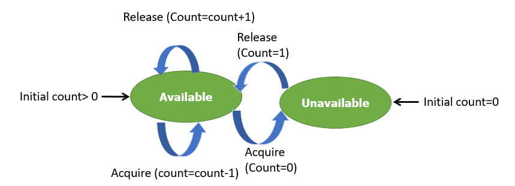
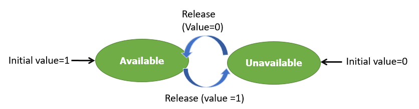

# Discussion Materials Week 8

Producer-Consumer problem, more about locks and condition variables, open Q&A

## Producer-Consumer Problem
This classic problem in computer science, also known as the bounded-buffer problem, is a family of problems discovered by Edsger W. Dijkstra back around 1965. 

In this problem, we have a "producer", which produces something and a "consumer" which consumes the products the producer produces. In our case, it is easiest to imagine the producer is writing to shared memory, and the consumer is reading from the same shared memory. Also note that the shared memory would be of fixed size.

What could go wrong in this situation:
* The producer should only produce data when the buffer is not full
* The consumer should consume data when the buffer is not empty
* The producer and consumer should not access the buffer at the same time

How can we ensure the proper protections for our buffer?
---
**Semaphores:** A non-negative variable that can be shared between threads. It uses 2 atomic operations: `wait()` and `signal()`. Here is pseudocode of what each operation does:
```
Wait() {
    while(semaphore == 0); // Wait until available
    semaphore --;
}

Signal() {
    semaphore ++;
}
```

There are two types of semaphores:

**Counting Semaphores:** Acts as a shared counter. Typically used to coordinate access to shared resources, where the count is initialized to th enumber of free resources. If the count is ever 0, then it will exist in the unavailable state. However, if the count is greater than 0, the semaphore is in the available state.



**Binary Semaphores:** Similar in nature to counting semaphores, although the count is restricted to only 0 and 1. Thus, the only state transitions are between unavailable and available, instead of being able to transition state from available to available. 




### Note that **semaphores are quite similar to mutexes**. There is a somewhat popular example of the core differences called **The Bathroom Example**:
* Mutexes: A single key to the bathroom. One person can have the key and occupy the bathroom at a time. When finished, the person exits the bathroom and gives the key to the next person in the queue.
* Semaphores: Multiple unoccupied identical bathroom keys. If we have multiple bathrooms with identical locks and keys, the semaphore count is set to that number, and as people occupy the bathrooms, the count is decremented. As people leave the bathrooms, the count is incremented. Hence, when the count is 0, the semaphore is in the unavailable state. But when one person exits the bathroom and the count is reset back to 1, the semaphore is once again available.

**How do binary semaphores differ from mutexes?** Semaphores can be used as mutexes, although mutexes can never be used as semaphores. In the case of a binary semaphore, there is only one bathroom, so within the scope of the analogy above, they operate identically. However, the main difference is that a binary semaphore can be used for synchronization (i.e. "Hey someone! This thing occurred!") The "giver" notifies the "taker" that what they were waiting for happened. 

Imagine if, in the bathroom example, we have to wait for class to be over to go to the bathroom. The bathroom is theoretically available, however we still need to `wait()` for the professor to `signal()` that class has ended. This situation is something semaphores allow us to mimic, although mutexes could never.

---
## How do semaphores allow us to address the producer and consumer problem?
Use 3 semaphores: two counters and one binary:
* **Semaphore S:** Semaphore used to achieve mutual exclusion between threads. Mimics (and can be replaced by) a mutex.
* **Semaphore E:** Semaphore used to define empty space in the buffer. Intiially set to the whole space of the buffer, because the buffer starts empty.
* **Semaphore F:** Semaphore used to define space filled by the producer. Initially set to 0 because the producer hasn't produced anything at init.

We can solve the producer and consumer problem in the following fashion:
```
void producer() {
    while(T) {
        produce() // Produce data
        wait(E)   // Reduce value of empty space in buffer
        wait(S)   // Lock the shared buffer
        append()  // Write the produced data to the buffer
        signal(S) // Unlock the buffer
        signal(F) // Increment the space filled in the buffer
    }
}
```

```
void consumer() {
    while(T) {
        wait(F)   // Decrease filled space due to consumption
        wait(S)   // Lock the shared buffer
        take()    // Take data from buffer
        signal(S) // Unlock buffer
        signal(E) // Increment free space in buffer after consumption
        use()     // Use/process the data from the buffer
    }
}
```

## Priority Inversion
Whenever implementing mutual exclusion (using locks or semaphores) it is possible that your implementation will suffer from priority inversion, where a lower priority task effectively prevents a high priority task from completing its job. It can be quite difficult to detect, and can cause for some major performance loss. Lets look at the following scenario:

```
Three Threads:
High Priority (H)
Medium Priority (M)
Low Priority (L)

Shared Resource: Critical Section (CS), locked by a mutex

The following scenario occurs:
1. L runs, and H tries to access CS while L is executing within it.
2. As CS is not available, H sleeps.
3. M arrives. As M has higher priority than L and it doesn’t need to be executed in CS, L gets pre-empted by M, which then runs.
4. M finishes, then L executes for the remaining portion and releases CS; only then does H get resources.
5. H executes.

H was now effectively preempted by M
```

How can we prevent this situation?

**Priority Inheritance:** Since the mutex knows its current owner, it is possible to promote the priority of the owner temporarily whenever a higher-priority task starts waiting on the mutex. Thus, the owner of the mutex can resume running if it was preempted by a mid-priority task, and can continue running if a mid-priority task becomes ready to run. When the owner releases the lock, it drops to its original priority.

A much easier solution, however, is merely to ensure that all threads have the same priority.
