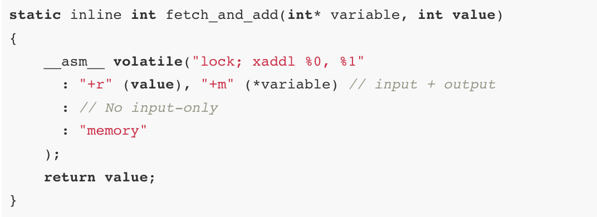

# Discussion Materials Week 9

Next assignment will be about kernel thread creation more specially implementing clone function. ```int clone(void(*fcn)(void*), void *arg, void*stack)```. In order to create new thread which runs given function, shares the calling process's address space. and on its own private stack, you must have understaning of how function call works in OS. Specifically, Here, In the first part, we will study exactly how the stack works when calling a function. Lastly we will discuss how to build locks using fetch and add hardware instruction. 

## XV-6 Function Call  
Each computer program uses a region of memory called the stack to enable functions to work properly. Hence it is crucial to understand how stack is utilized in the function call. 

Firstly, let's review some terminology about stack and registers. ```%esp``` is the current stack pointer, which will change any time a word or address is pushed or popped onto/off off the stack. ```%ebp``` base register is a more convenient way for the compiler to keep track of a function's parameters and local variables than using the ```%esp``` directly. You could assume that the stack pointer can be used for this. However, you may use the stack for additional purposes throughout your program, like as passing arguments to other functions which changes stack pointer. 

We will take a look at how a function call works in a real program. The function we are going to write is the power function. The following is the assembly code for the complete program.

```
#PURPOSE: Program to illustrate how functions work
# This program will compute the value of
# 2^3 

.section .data
.section .text

.globl _start
_start:
    pushl $3                #push second argument
    pushl $2                #push first argument
    #-------------------------------(before execution)
    call power              #call the function
    #------------------------------- (After execution)
    addl $8, %esp           #move the stack pointer back
    movl $1, %eax           #exit (%eax is returned)
    int $0x80

#PURPOSE: This function is used to compute the value of 
#a number raised to a power.

#INPUT: First argument - the base number
# Second argument - the power to raise it to

#OUTPUT: Will give the result as a return value

#NOTES: The power must be 1 or greater

#VARIABLES:
# %ebx - holds the base number
# %ecx - holds the power    

.type power, @function
power:
    pushl %ebp              #save old base pointer
    movl  %esp, %ebp        #make stack pointer the base pointer
    subl  $4, %esp          #get room for our local storage
    movl  8(%ebp), %ebx     #put first argument in %eax
    movl  12(%ebp), %ecx    #put second argument in %ecx
    movl  %ebx, -4(%ebp)    #store current result

power_loop_start:
    cmpl  $1, %ecx          #if the power is 1, we are done
    je    end_power
    movl  -4(%ebp), %eax    #move the current result into %eax
    imull %ebx, %eax        #multiply the current result by
    #the  base number
    movl  %eax, -4(%ebp)    #store the current result
    decl  %ecx              #decrease the power
    jmp   power_loop_start  #run for the next power

end_power:
    movl  -4(%ebp), %eax    #return value goes in %eax
    movl  %ebp, %esp        #restore the stack pointer
    popl  %ebp              #restore the base pointer
    ret
```


We will understand the program step by step and visulize the configuration of the stack in each step. 

### Before function execution:
A program pushes all of the parameters for the
function onto the stack in the reverse order that they are documented. Here, we will push base number and exponent onto the stack. Then the ```call``` instruction, push the return address (the address of the next instruction to be executed after the function returns). Then it modifies the instruction pointer ```%eip``` to point to the start execution of the function. 


```
Base Number
Power
Return Address <--- (%esp)
```

### In function execution:
As it can be seen in the power function implementation, program  save the current base pointer register, ```%ebp```, by doing ```pushl %ebp```. Then it copies stack pointer to allows program to always know where your parameters are with respect to  ```%ebp```.  Now, stack will look like this, 

```
Base Number     <--- 12(%ebp)
Power           <--- 8(%ebp)
Return Address  <--- 4(%ebp)
Old %ebp        <--- (%esp) and (%ebp)
```

Next, the function reserves space on the stack for one local varible in which we will store intermediate result. This is done by simply moving the stack pointer downwards. After this,function is started executing as usual. 

```
Base Number      <--- 12(%ebp)
Power            <--- 8(%ebp)
Return Address   <--- 4(%ebp)
Old %ebp         <--- (%esp) 
Local Variable   <--- -4(%ebp) and (%esp)
```

### After function execution:
When a function is done executing, it does three things: Firstly,it stores return value in ```%eax```. Secondly, it reconfigure stack frame to where it was called from. Specifcally, it moves ```%esp``` to ```%ebp``` and put the ```%eax``` to the original location. And lastly, ```ret```  instruction will pops value is at the top of the stack, and sets the instruction pointer, ```%eax```, to that value. 

In the final stage, timer interrupt is performed and control is given to the OS.  


## Locks using Fetch and Add instruction


Firstly to understand fetch and add instruction, we will look at its pseudocode.  

```
int FetchAndAdd(int *ptr) {
  int old = *ptr;
  *ptr = old + 1;
  return old;
  }
```


It relatively simple hardware instruction which atomically increment a value while returning the old value at a particular address. For completeness, x86 implementation is also included. After understading FAA, let's see how it can be used in building locks. 

```
typedef struct __lock_t {
    int ticket;
    int turn;
  } lock_t;
 
  void lock_init(lock_t *lock) {
    lock->ticket = 0;
    lock->turn = 0;
  }

  void lock(lock_t *lock) {
    int myturn = FetchAndAdd(&lock->ticket);
    while (lock->turn != myturn)  ; // spin
 }

 void unlock(lock_t *lock) {
    lock->turn = lock->turn + 1;
 }
```

This lock implementation uses a ticket and turn variable in
combination to build a lock. Whereas other locking mechanism utilize only single value. The global variable ``` lock->turn``` is shared across all the threads to determine which thread's turn it is. In the lock function, we will apply FAA instruction on ticket value and it will be considered as thats thread turn.  When ```(myturn == turn)``` is true than that particular thread will enter the critical section. To unlock we will just simple increment the turn counter and lock will be given to the next thread. 

## References

1. [Programming from the Ground Up (Chapter 3 and 4).](https://download-mirror.savannah.gnu.org/releases/pgubook/ProgrammingGroundUp-1-0-booksize.pdf)
2. [Prof. Remzi's discussion on XV-6 threads](https://www.youtube.com/watch?v=G9nW9UbkT7sab_channel=RemziArpaci-Dusseau)


